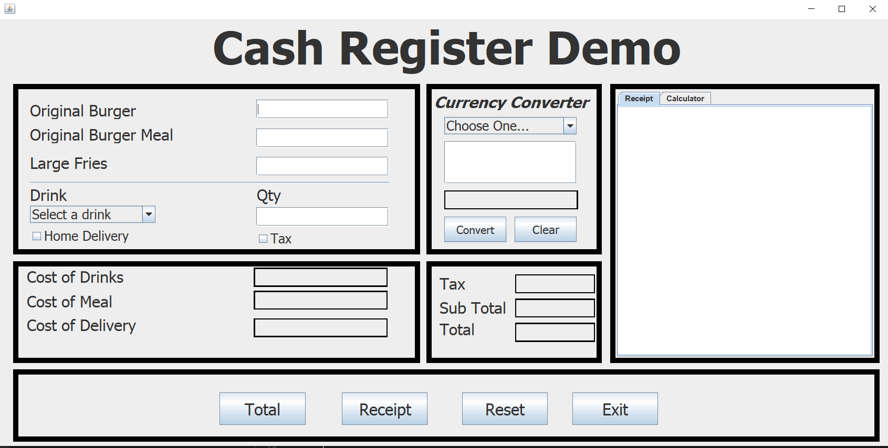
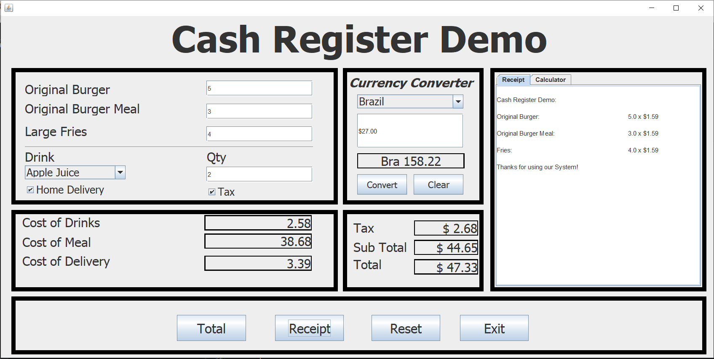

# Cash-Register-Demo
This is a basic cash register application that lets users input food and drink selections as well as quantity and the application will do the calculations giving you a subtotal, a total after tax, and it even creates a Receipt. Although it isnt super amazing This project taught me the basics of Graphical user interfaces (GUI) in java and i also learned a lot of java in the process.
 

